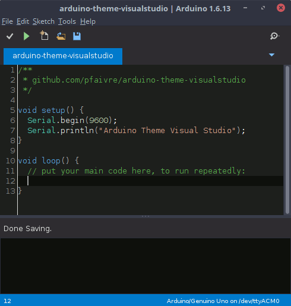

# arduino-theme-visualstudio
A clean dark theme for the Arduino IDE inspired by Visual Studio

## Installation

1. Open the repertory `lib` in the folder where Arduino is installed. On 
Windows, it should be in `C:\Program Files (x86)\Arduino\lib`.
2. Rename the folder `theme` to `theme.old`.
3. Copy the folder `theme` of this repository next to the previous one.

